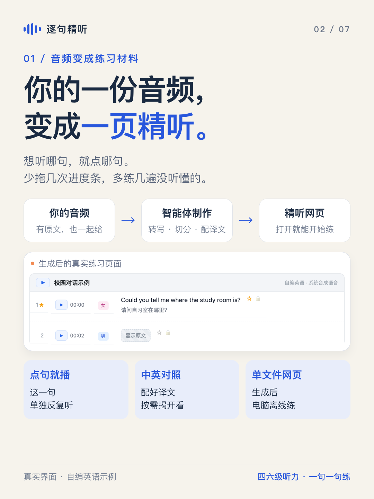
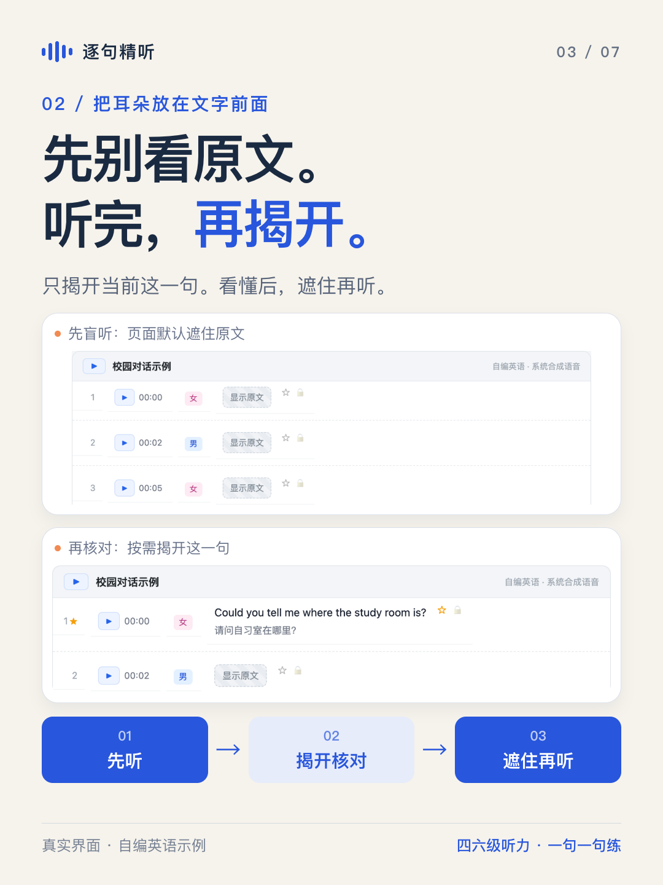
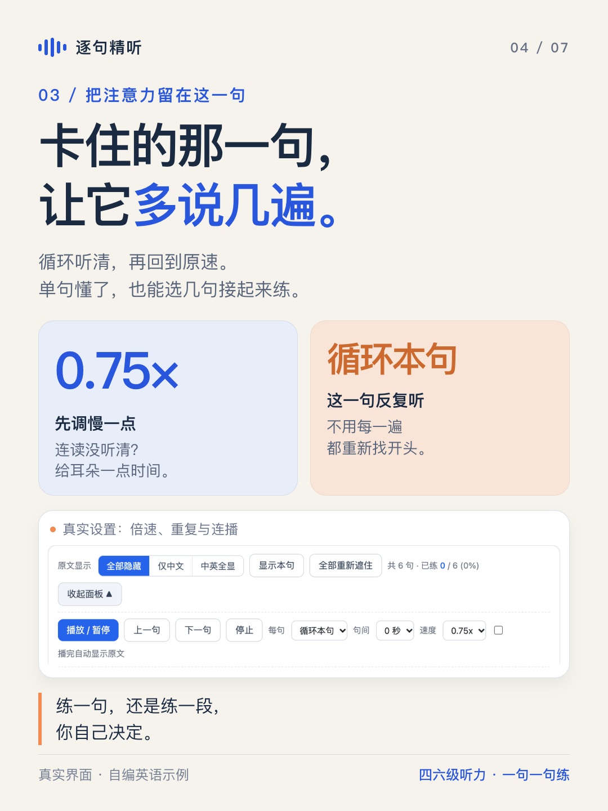
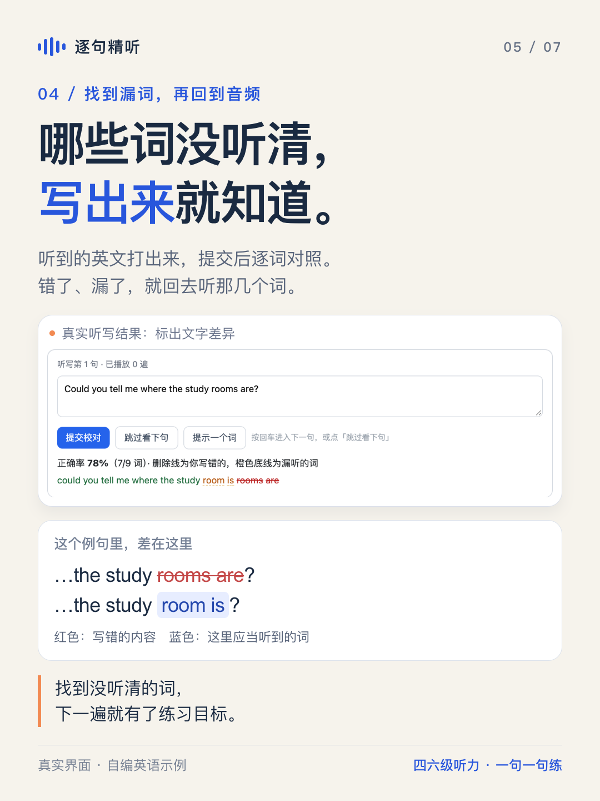
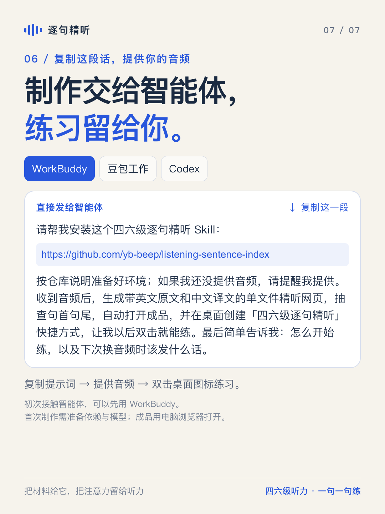

# 四六级听力，终于能一句一句练了

摘要：把你手里的听力音频，做成一个逐句精听网页。想听哪句就点哪句，没听懂就循环，漏了哪个词就听写，难句标星留到下一轮。把文末的提示词发给 WorkBuddy、豆包工作或 Codex，让智能体处理制作。

练四六级听力，最让人着急的时刻，往往是：

整段大意听懂了，偏偏那一句没听清。

你拖回进度条，想再听一次。拖早了，得等前面一截；拖晚了，句子开头又没了。打开原文吧，又容易变成“看懂了，所以以为听懂了”。

我做了一个「逐句精听」Skill：**把一整段音频，变成一句一句可以单独练的材料。**

四级、六级都可以用。你准备音频，有配套原文也一起提供；让能运行本地脚本的智能体按这套流程制作，最后得到一个精听网页。

**想听哪句，就点哪句。想多练哪句，就留在哪句。**

## 01 你的音频，变成一页精听材料

打开成品，播放入口、英文原文和练习功能都在同一页。配好译文后，也能一起看中文对照。

音频已经装进单文件版 HTML，在电脑浏览器打开就能练，生成后也能离线使用。

对练习的人来说，省下的是那些重复的小动作：找句子、切回播放器、核对原文，再重新找一次。

## 02 先别看原文，听完再揭开

页面默认遮住原文。先听，听不清可以再播；需要确认时，只揭开当前这一句。

看懂后，再遮住听一次。你就能检查：这句是靠文字认出来的，还是耳朵已经能听出来了？

## 03 卡住的那一句，让它多说几遍

选「循环本句」，把注意力留在这一句。觉得太快，可以先调到 0.75 倍，听清后再回到原速。

如果单句已经听懂，接起来却跟不上，也可以选几句连播，两三句一组练。

练一句，还是练一段，你自己决定。

## 04 漏了哪个词，写下来更容易看见

切到听写，把听到的英文打出来，提交后和原文逐词比较。写错的、漏掉的，会在页面里标出来。

比如 **room is** 听成了 **rooms are**，对照时就能看清差在哪。接着回去听这几个词，练习就有了具体的目标。

卡住时，也能先提示一个词。听写的作用是帮你找到差异，再回到音频里确认。

## 05 难句标个星，下次接着练

这次没听懂，先给它标颗星。下一轮筛选「只看星标」，集中复习这些句子。

听懂一条，取消一颗星。你能把时间花在还需要练的地方。

记录保存在当前浏览器里，方便回来继续；换设备或浏览器，记录不会自动同步。

## 06 制作交给智能体，练习留给你

把下面这段话复制给 **WorkBuddy、豆包工作或 Codex**，再把音频给它。有配套原文，也一起提供。

> 请帮我安装这个四六级逐句精听 Skill：https://github.com/yb-beep/listening-sentence-index 。按仓库说明准备好环境；如果我还没提供音频，请提醒我提供。收到音频后，生成带英文原文和中文译文的单文件精听网页，抽查句首句尾，自动打开成品，并在桌面创建「四六级逐句精听」快捷方式，让我以后双击就能练。最后简单告诉我：怎么开始练，以及下次换音频时该发什么话。

下载、安装、转写、切分、配译文和生成页面，交给智能体按 Skill 处理。你不用先学一套命令，只需要说清想做哪份材料。

智能体会打开成品，并按提示词创建桌面快捷方式。之后双击桌面图标，就能进入这份材料练习。首次制作需要依赖和识别模型，所用智能体的工作环境应具备文件和脚本执行能力。

**下一次练听力，就从最想听懂的那一句开始。**

先盲听，再对照；没听懂，就循环；容易漏，就听写；需要复习，就标星。

把你的音频做成自己的精听页，给练习多一点顺手的工具。

*配图中的英语句子为自编示例，使用合成语音展示真实页面交互。公开分享成品时，请使用具有相应授权的音频和原文。*
